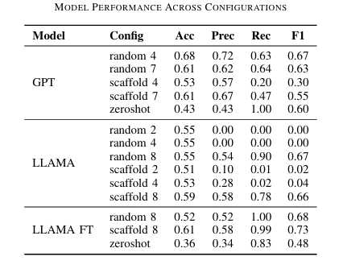

# 🔬 Molecular Property Prediction – Classification Task

## 📌 Overview
This module focuses on **molecular property classification** using Large Language Models (LLMs). The task involves predicting whether a given molecule—represented as a **SMILES string**—exhibits a specific property (e.g., high conductivity).

The implementation is inspired by the benchmark study:  
**“What can Large Language Models do in chemistry? A comprehensive benchmark on eight tasks”**, and aims to replicate and extend its experimental setup under constrained resources.

---
## 📚 Table of Contents

- [🎯 Objective](#-objective)
- [⚙️ Methodology](#️-methodology)
  - [🧠 In-Context Learning (ICL)](#-in-context-learning-icl)
  - [📊 Context Construction](#-context-construction)
    - [Random Sampling](#1-random-sampling)
    - [Scaffold Sampling](#2-scaffold-sampling)
  - [🔢 Number of Context Samples](#-number-of-context-samples)
- [🧪 Experimental Setup](#-experimental-setup)
  - [🔒 Closed Model Benchmarking](#-closed-model-benchmarking)
  - [🌐 Open Model Benchmarking & Fine-Tuning](#-open-model-benchmarking--fine-tuning)
- [📈 Key Observations](#-key-observations)
- [📓 Notebook Usage](#-notebook-usage)
- [🙏 Credits](#-credits)

## 🎯 Objective
- **Input:** SMILES representation of a molecule  
- **Output:** Binary classification label (e.g., High / Low property)

The goal is to evaluate how effectively LLMs can act as **discriminative models** for molecular property prediction using:
- In-context learning (ICL)
- Different sampling strategies
- Both closed and open-source models

---

## ⚙️ Methodology

### 🧠 In-Context Learning (ICL)
We use **few-shot prompting**, where:
1. A set of labeled molecule examples is provided as context  
2. A new (test) SMILES string is appended  
3. The model predicts the corresponding label  

---

### 📊 Context Construction

#### 1. Random Sampling
- Randomly selects molecules from the dataset  
- Serves as a baseline approach  

#### 2. Scaffold Sampling
- Selects molecules based on **chemical scaffolds**  
- Ensures structural diversity  
- Produces more chemically meaningful context  

---

### 🔢 Number of Context Samples
We experiment with:
- **4-shot prompting**
- **7-shot prompting**

These configurations help evaluate how context size impacts performance.

---

## 🧪 Experimental Setup

### 🔒 Closed Model Benchmarking
We replicate the original paper’s setup as closely as possible.

- **Model:** GPT-4o-mini  
- **Prompting Strategy:** In-Context Learning  
- **Sampling Methods:** Random, Scaffold  
- **Shots:** 4 and 7  

#### ⚠️ Constraints (Free API Tier)
- Limited number of prompts per day  
- Token usage restrictions  
- Reduced context size compared to the original benchmark  

---

### 🌐 Open Model Benchmarking & Fine-Tuning

We extend the experiments using an open-source model:

- **Base Model:** LLaMA-based (e.g., Llama-3.2-3B-Instruct)

#### Workflow:
1. Run the same ICL benchmarking setup  
2. Evaluate baseline performance  
3. Fine-tune the model using prompt–label pairs  
4. Re-evaluate performance  

#### 🎯 Goal:
Improve:
- Stability  
- Recall  
- Overall classification performance  

---
## 📈 Key Observations
- **ICL is essential**: Zero-shot performance is poor  
- **Sampling strategy matters**: Scaffold-based sampling improves results  
- **Context size helps**: More examples improve predictions  
- **Fine-tuning improves performance**:
  - Better stability  
  - Higher recall and F1 score

**Trade-off:**  
Fine-tuning improves accuracy but may reduce sensitivity to prompt context.

---

# Notebook Usage

1. Download the notebooks or clone the repository to your environment.
2. Use a Jupyter or any python environment. For best results use Google Colab Notebooks
3. Create an OpenAI API key from the OpenAI website and fill in the placeholder for the API KEY
4. The notebooks will create a zip file and can be downloaded from the UI

# Credits

Original repo: [*ChemLLMBench*](https://github.com/ChemFoundationModels/ChemLLMBench) 
Notebook     : [*Property_Prediction*](https://github.com/ChemFoundationModels/ChemLLMBench/blob/main/Property_Prediction.ipynb) 
Data         : [*Data*](https://github.com/ChemFoundationModels/ChemLLMBench/blob/main/data/property_prediction/BACE.csv)

