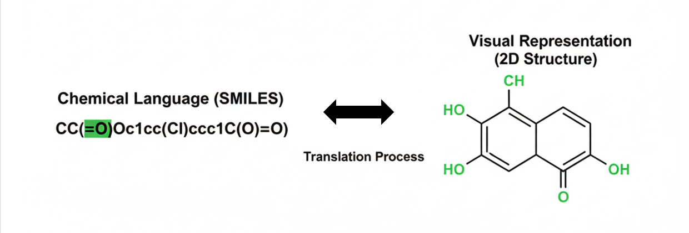
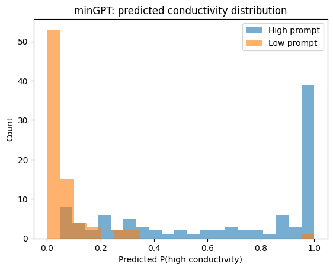
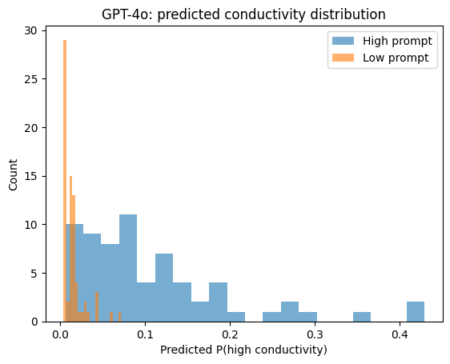
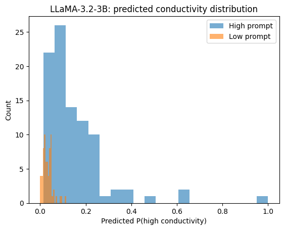
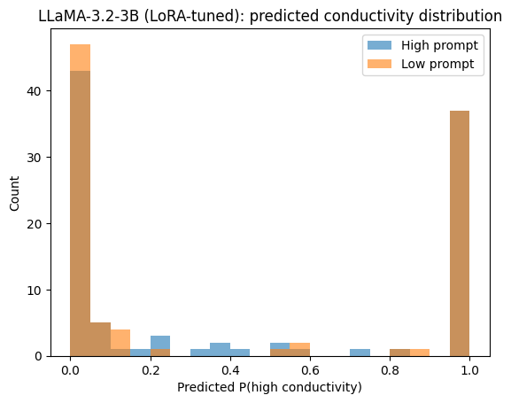

# Inverse Design

---

## Introduction

Designing new electrolytes is a key challenge in battery research, where safety, performance, and longevity depend heavily on molecular properties. Traditional molecular ML models predict properties from known structures, but many real-world tasks—like discovering novel materials—require the inverse: generating molecules with desired properties.

Large Language Models (LLMs), though built for text, can be repurposed for molecular design by expressing molecules as linear notations like SMILES or p-SMILES. This enables conditional generation of molecules guided by target properties, offering a flexible approach to inverse design.

In this project, we explore inverse design for polymer electrolytes using both open-weight and API-based LLMs. We reproduce the PolyGen benchmark (minGPT), compare with GPT-4o and LLaMA-3.2-3B, and further fine-tune LLaMA on polymer SMILES using LoRA. We evaluate the generated molecules across six molecular-level metrics, and analyze their functional groups to assess alignment with conductivity prompts. Our findings highlight the potential—and current limitations—of using LLMs for conditional molecular generation in materials science.

---

## Table of Contents

- [Introduction](#introduction)
- [Method](#method)
- [Data](#data)
- [How to run](#how-to-run)
- [Results](#results)
- [Project structure](#project-structure)
- [Acknowledgements](#acknowledgements)
- [Reference](#reference)

---

## Method

In this project, we explore conditional inverse design of polymer electrolytes using large language models. We start by reproducing the PolyGen minGPT results as a baseline, including its six evaluation metrics (uniqueness, novelty, validity, synthesizability, similarity, diversity). 

We then apply GPT-4o and LLaMA-3.2-3B for inverse design via natural language prompting, generating new polymer candidates under “high” and “low” conductivity conditions. 

To further align with PolyGen's conditional generation setup, we fine-tune LLaMA on the HTP-MD dataset, following PolyGen’s tokenization and conditioning strategy. The fine-tuning uses LoRA adapters to reduce trainable parameters.

Finally, we evaluate all four models (minGPT, GPT-4o, base LLaMA, fine-tuned LLaMA) using the same six metrics. Additionally, we perform functional group analysis to understand the chemical patterns favored by each model and condition.

#### Key Methods: Inverse molecular design with LLMs, LoRA fine-tuning, tokenizatio (p-SMILES), conditional generation

---

## Data

We represent molecular structures using SMILES (Simplified Molecular Input Line Entry System), a notation that encodes molecules as character sequences describing atoms and bonds.

- **What it is**: SMILES is a linear text-based format for representing chemical structures.
- **Why we use it**: SMILES strings are directly compatible with transformer-based Large Language Models (LLMs), which are designed to process sequential token data.
- **Our purpose**: By treating SMILES as a form of “chemical language,” we can leverage LLMs for molecule generation and property-conditioned design.

For training and evaluation, we use [htp_md.csv](data/raw/htp_md.csv), a dataset containing polymer candidates with SMILES representations and binary conductivity labels (high/low). These SMILES are used both as LLM input/output and for downstream property evaluation.



*Example of how a 2D molecular structure maps to its SMILES string.*


---

## How to run

This section outlines the key steps to reproduce our experiments and evaluate inverse design results.

### 1. Set up the environment

Install required packages:

```bash
pip install -r requirements.txt
```

Make sure your environment includes:
- `transformers`, `peft`, `datasets`, `scikit-learn`, `rdkit`, etc.
- GPU is recommended for LLM inference and fine-tuning


### 2. Reproduce minGPT results

Use the original PolyGen-style minGPT pipeline:

```python
notebooks/generation/minGPT_pipeline.ipynb
```

Results are saved in:

```
data/generated/
```


### 3. Generate SMILES using GPT-4o and base LLaMA

Prompt-based inverse design using language models:

```python
notebooks/generation/gpt4o_generate.ipynb
notebooks/generation/llama_generate.ipynb
```

Cleaned outputs are stored under:

```
data/generated/
```


### 4. Fine-tune LLaMA on HTP-MD (PolyGen-style)

Fine-tune `meta-llama/Llama-3.2-3B-Instruct` using LoRA on HTP-MD data:

```python
notebooks/generation/llama_finetune_htpmd.ipynb
```

Input format:

```
[<HIGH>, <HIGH>, <HIGH>, <HIGH>, <HIGH>] + SMILES
```

The fine-tuned model is saved under:

```
models/llama-polygen-htpmd-lora/
```


### 5. Generate with fine-tuned LLaMA

Conditionally generate p-SMILES using the fine-tuned model:

```python
notebooks/generation/llama_generate_tuned.ipynb
```


### 6. Evaluate generated SMILES

Compute all evaluation metrics:

- Validity
- Uniqueness
- Novelty
- Synthesizability
- Similarity
- Diversity

Also includes functional group analysis.

Run:

```python
notebooks/evaluation/compute_metrics.ipynb
```

Outputs are saved to:

```
results/metrics/
```

---

## Results

### 1. Generative quality of different models

We evaluate inverse-design performance for four model families  
(minGPT, GPT-4o, LLaMA-3.2-3B, and LLaMA-3.2-3B fine-tuned on HTP-MD with LoRA)  
using the six metrics from the PolyGen paper (see [Reference](#reference)).

| Model              | Uniqueness | Novelty | Validity | Synthesizability | Similarity | Diversity |
|--------------------|-----------:|--------:|---------:|-----------------:|-----------:|----------:|
| minGPT Low         | 1.00 | 0.96 | 0.77 | 0.68 | 0.26 | 0.74 |
| minGPT High        | 0.96 | 0.61 | 0.95 | 0.95 | 0.26 | 0.69 |
| GPT-4o Low         | 0.99 | 1.00 | 0.01 | 1.00 | 0.16 | –   |
| GPT-4o High        | 1.00 | 1.00 | 0.21 | 0.48 | 0.20 | 0.79 |
| LLaMA Low          | 1.00 | 1.00 | 0.03 | 0.33 | 0.15 | 0.77 |
| LLaMA High         | 1.00 | 1.00 | 0.58 | 0.45 | 0.21 | 0.74 |
| LLaMA Low tuned    | 0.97 | 0.48 | 0.99 | 0.79 | 0.26 | 0.73 |
| LLaMA High tuned   | 0.99 | 0.46 | 0.95 | 0.90 | 0.27 | 0.73 |

Short observations:

- All models generate mostly unique structures; novelty is high for untuned GPT-like models and lower for the tuned LLaMA, which reuses more training-set patterns.
- minGPT shows a good balance between validity and novelty and serves as a strong baseline.
- GPT-4o and untuned LLaMA reach very high novelty but often fail chemical validity, especially under the “low” prompt.
- Fine-tuning LLaMA on HTP-MD dramatically improves validity and synthesizability for both prompts, while keeping diversity at a similar level.


### 2. Functional-group distributions

To understand what chemistry each model explores, we run RDKit SMARTS matching  
(using Zhan-Yun’s `getCategory.py`) and assign each generated SMILES to a main
functional-group category (amides, ethers, ketones, other esters, nitriles, etc.).

Below is the percentage of valid molecules per category (rounded):

| Functional group     | minGPT High | minGPT Low | GPT-4o High | GPT-4o Low | LLaMA High | LLaMA Low | LLaMA High tuned | LLaMA Low tuned |
|----------------------|-----------:|----------:|------------:|-----------:|-----------:|----------:|-----------------:|----------------:|
| Amides               | 34.4 | 55.0 | 35.8 | 0.0 | 20.4 | 0.0 | 44.4 | 50.5 |
| Ethers               | 5.2  | 1.2  | 22.4 | 0.0 | 23.7 | 19.4 | 0.0  | 0.0  |
| Ketones              | 1.0  | 1.2  | 13.4 | 27.4 | 6.5  | 19.4 | 1.0  | 1.0  |
| Nitriles             | 2.1  | 3.8  | 0.0  | 0.0 | 0.0  | 0.0  | 2.0  | 2.0  |
| Other Esters         | 57.3 | 36.2 | 10.4 | 0.0 | 41.9 | 0.0  | 54.5 | 46.5 |
| Others / Sulfones…   | ~0–1 | ~1   | 18.0+ | 72.6 | ~7–8 | 61.2 | ~0–1 | ~0–1 |

Main trends:

- minGPT mostly generates amide- and ester-based backbones for both high and low prompts, which matches the chemistry present in HTP-MD.
- GPT-4o “low” generations fall largely into the catch-all “Others” category, suggesting less chemically structured responses despite strong text-level control.
- Untuned LLaMA explores a broader mix of ethers, esters and ketones; the “low” prompt again drifts toward generic “Others”.
- After fine-tuning, LLaMA collapses onto amide/ester chemistries for both prompts with very high validity.  
  This indicates that the model has learned a chemically realistic style of polymer electrolytes,  
  while the distinction between high- and low-conductivity prompts is encoded more in subtle structural variations than in completely different functional-group classes.

These analyses complement the scalar metrics above: they show not only how often the models
produce valid and diverse SMILES, but also which parts of polymer-electrolyte chemical space
each model actually occupies.


### 3. Alignment Evaluation for Generated SMILES

To check whether the generators really respond to the *high / low conductivity* prompts, we use a separate supervised model as an oracle.

We first train baseline conductivity classifiers on the HTP-MD dataset. Each SMILES is converted to a 2048-bit Morgan fingerprint (radius = 2), and we fit a RandomForest and an XGBoost model. Both reach ≈0.99 ROC-AUC on a held-out test set, so we use the RandomForest as a proxy that maps any SMILES to a probability of being high-conductivity, \(P(\text{high})\).

For each generator (minGPT, GPT-4o, LLaMA-3.2-3B, and LoRA-tuned LLaMA-3.2-3B) and for each prompt type (high vs low), we then:

1. Compute Morgan fingerprints for all generated SMILES.  
2. Obtain the RandomForest prediction \(P(\text{high})\) for every molecule.  
3. Compare the distributions of \(P(\text{high})\) for high-prompt vs low-prompt samples and compute an *alignment AUC* by treating high-prompt samples as label 1 and low-prompt samples as label 0.

If high-prompt molecules tend to have large \(P(\text{high})\) and low-prompt molecules small \(P(\text{high})\), the two distributions separate and the alignment AUC is close to 1. This suggests that the generator is not only producing valid polymers, but also follows the desired property direction.

**Quantitative results**

| Model                        | Mean P(high) (High prompt) | Mean P(high) (Low prompt) | Alignment AUC |
|-----------------------------|----------------------------|---------------------------|---------------|
| minGPT                      | 0.665                      | 0.062                     | 0.957         |
| GPT-4o                      | 0.107                      | 0.014                     | 0.951         |
| LLaMA-3.2-3B                | 0.148                      | 0.033                     | 0.901         |
| LLaMA-3.2-3B (LoRA-tuned)   | 0.438                      | 0.423                     | 0.511         |

**Interpretation**

- **minGPT** shows a very clear separation between high-prompt and low-prompt distributions. The classifier assigns high \(P(\text{high})\) to high-prompt samples and low values to low-prompt samples, giving the highest alignment AUC.  
- **GPT-4o** and **base LLaMA-3.2-3B** also react to the prompts: low-prompt molecules concentrate near \(P(\text{high}) \approx 0\), while high-prompt molecules shift to higher probabilities, though with weaker separation than minGPT.  
- **LoRA-tuned LLaMA-3.2-3B** improves validity and synthesizability, but the two distributions of \(P(\text{high})\) almost overlap, so the alignment AUC drops close to 0.5. This suggests that the fine-tuning mainly helped the model to speak the “polymer language” but did not preserve a strong high/low conductivity control signal.

**Histogram view**

The figures below visualize the predicted \(P(\text{high})\) distributions from the RandomForest for each generator:

<p align="center">
  
  
  
  
</p>

Each panel overlays high-prompt (blue) and low-prompt (orange) histograms, giving a visual check of how strongly each model separates the two property conditions.


---

## Project structure

The repository is organized as follows:

    inverse-design
    ├── data
    │   ├── generated    # SMILES generated by different models
    │   └── raw          # Source datasets, including HTP-MD data and PolyGen training splits
    ├── minGPT           # Reference or local copy of the original minGPT implementation
    ├── models
    │   └── llama-polygen-htpmd-lora    # LoRA adapter and tokenizer for the fine-tuned LLaMA model
    ├── notebooks
    │   ├── baseline     # Baseline experiments 
    │   ├── evaluation   # Evaluation metrics and functional group analysis
    │   └── generation   # SMILES generation using different models
    ├── requirements.txt
    └── results
        ├── metrics      # Aggregated evaluation results
        └── baselines    # Alignment evaluation results for generated SMILES
---

## Acknowledgements 

This repository is based on the open-source project **PolyGen** developed by the TRI-AMDD team:

- Original repository: https://github.com/TRI-AMDD/PolyGen

Parts of the code and experimental setup in this repository were adapted from PolyGen.  
In particular, the original PolyGen implementation incorporates and builds upon prior work on:

- minGPT by Karpathy: https://github.com/karpathy/minGPT  

This fork reproduces selected components of PolyGen and extends them with additional experiments and analyses.  
We welcome questions, suggestions, and contributions from the community.

---

## Reference

@article{yang2023novo, title={De novo design of polymer electrolytes with high conductivity using gpt-based and diffusion-based generative models}, author={Yang, Zhenze and Ye, Weike and Lei, Xiangyun and Schweigert, Daniel and Kwon, Ha-Kyung and Khajeh, Arash}, journal={arXiv preprint arXiv:2312.06470}, year={2023} }