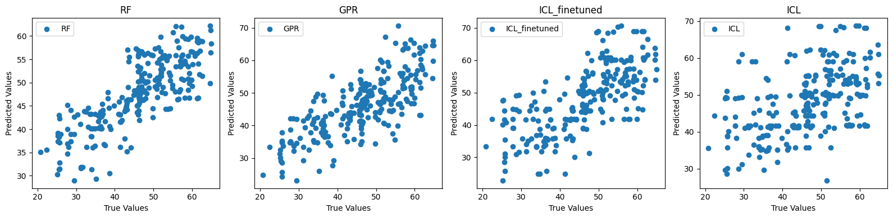
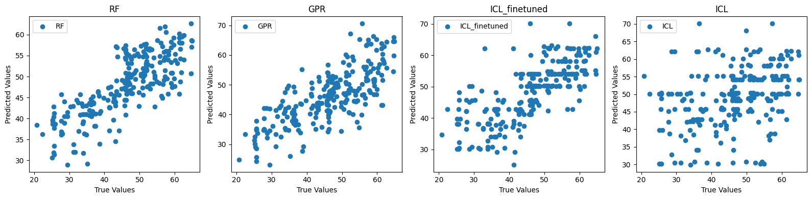
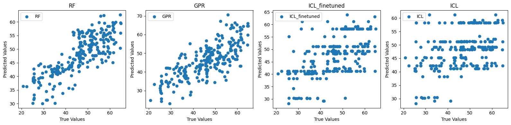
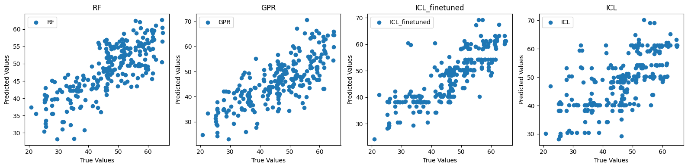

# Regression - From Text to Concrete: Developing Sustainable Concretes with In-Context Learning

## Introduction
This repository contains the code and dataset for the study "From Text to Concrete: Developing Sustainable Concretes with In-Context Learning". The project aims to improve the development of sustainable concrete formulations using in-context learning (ICL) and large language models (LLMs). By leveraging the potential of LLMs, this research aims to overcome the limitations of traditional methods and accelerate the discovery of novel, sustainable, and high-performance materials.

### Credit
This repository is originally a fork, based on previous work that can be found at https://github.com/ghezalahmad/LLMs-for-the-Design-of-Sustainable-Concretes.

### Changes
As the text-davinci-003 model is deprecated, it is no longer used in this project. Instead, we test several LLMs on the original data, both closed- and open-source models. The LLMs that we use for benchmarking are:

- **GPT-3.5-Turbo-Instruct**
- **GPT-4o-mini**
- **Llama-3.2-3B-Instruct**
- **Llama-3.1-70B-Instruct-bnb-4bit**

We have made some changes to the code, the software and packages that were used. Finally, we slightly altered the given context prompts, and calculations of the metrics used to evaluate the model performance.

### Overview

The primary goal of this study is to compare the prediction performance of compressive strength using ICL and LLMs against established methods such as Gaussian Process Regression (GPR) and Random Forest (RF). The dataset comprises 240 alternative and more sustainable concrete formulations based on fly ash and ground granulated slag binders, along with their respective compressive strengths.

## Table of Contents

- [Installation](#installation)
- [Post-installation](#post-installation)
- [Hardware](#hardware)
- [Usage](#usage)
- [Results](#results)
- [Contributing](#contributing)
- [License](#license)
- [Acknowledgements](#acknowledgements)

## Installation

1. Clone the repository to your local machine using `git clone`:

    ```bash
    git clone https://github.com/username/repo.git
    ```

2. Change directory to the cloned repository:

    ```bash
    cd repo
    ```


We provide two different options for the rest of the setup

### Option 1: Using Apptainer to build and run a container on a Linux filesystem (recommended)

3. Change directory to container-recipes

    ```bash
    cd container-recipes
    ```

4. Build the container with Apptainer using the definition file
    ```bash
    apptainer build my-container.sif container-recipe.def
    ```

### Option 2: Download dependencies on a python environment using pip (not tested)

3. Install the dependencies using a package manager such as `npm` or `pip`:
    ```bash
    pip install -r container-recipes/requirements.txt
    ```


## Post-installation

5. Start a jupyter notebook

    Using Apptainer:
    ```bash
    apptainer exec --nv path-to-container jupyter notebook
    ```
    Using a python environment:
     ```bash
    jupyter notebook
    ```

6. Open a web browser and navigate to `http://localhost:3000` to access the application.
7. Create an OpenAI API key from the [OpenAI](https://platform.openai.com/api-keys) website, and follow the [safety instructions](https://help.openai.com/en/articles/5112595-best-practices-for-api-key-safety).
9. Prepare a CSV file with prompts and completions as input data. Update the file path in the code to point to your CSV file.
10. For the Llama models, update the model file path to the local file path, or alternatively the huggingface model ID to download it.

## Hardware
For inference of Llama-3.2-3B-Instruct and Llama-3.1-70B-Instruct-bnb-4bit we used a T4 and A40 GPU respectively.

## Usage
1. Run the different `Benchmarking-"model_name".ipynb` notebooks in your container or environment to train the completion predictor and generate completions for test data.
2. The completion predictor's performance will be evaluated using R-squared, MSE, and MAE metrics, which will be printed on the console. The resulting predictions will be saved as CSVs in the results folder for each model. 
3. Run the `Benchmarking-Results-"model_name".ipynb` notebooks for the evaluation of each model.
3. You can modify the code to customize the prompts, completions, and other parameters as needed for your specific use case.


## Results 
This section contains screenshots of the evaluation results for each LLM model compared to traditional ML models.

### GPT-3.5-Turbo-Instruct

#### Evaluation metrics
| Approach | R-squared | MSE | MAE |
| -------- | --------- | --- | --- |
| RF | 0.58 +- 0.11 | 44.65 +- 11.04 | 5.31 +- 0.69 |
| GPR | 0.53 +- 0.25 | 49.73 +- 25.08 | 5.67 +- 1.39 |
| ICL_finetuned | 0.37 +- 0.18 | 67.48 +- 24.33 | 6.21 +- 1.18 |
| ICL | 0.09 +- 0.33 | 100.03 +- 48.38 | 7.54 +- 1.58 |

#### Parity Plot


### GPT-4o-mini

#### Evaluation metrics
| Approach | R-squared | MSE | MAE |
| -------- | --------- | --- | --- |
| RF | 0.56 +- 0.11 | 46.85 +- 13.10 | 5.47 +- 0.78 |
| GPR | 0.53 +- 0.25 | 49.73 +- 25.08 | 5.67 +- 1.39 |
| ICL_finetuned | 0.45 +- 0.26 | 58.44 +- 25.51 | 5.66 +- 1.30 |
| ICL | -0.19 +- 0.50 | 127.82 +- 52.72 | 8.45 +- 1.92 |

#### Parity Plot

### Llama-3.2-3B-Instruct

#### Evaluation metrics
| Approach | R-squared | MSE | MAE |
| -------- | --------- | --- | --- |
| RF | 0.58 +- 0.09 | 45.01 +- 10.33 | 5.38 +- 0.59 |
| GPR | 0.53 +- 0.25 | 49.73 +- 25.08 | 5.67 +- 1.39 |
| ICL_finetuned | 0.26 +- 0.34 | 80.42 +- 42.50 | 7.12 +- 1.81 |
| ICL | 0.01 +- 0.39 | 105.54 +- 41.85 | 8.01 +- 1.79 |

#### Parity Plot


### Llama-3.1-70B-Instruct-bnb-4bit

#### Evaluation Metrics
| Approach | R-squared | MSE | MAE |
| -------- | --------- | --- | --- |
| RF | 0.56 +- 0.10 | 47.04 +- 13.36 | 5.48 +- 0.87 |
| GPR | 0.53 +- 0.25 | 49.73 +- 25.08 | 5.67 +- 1.39 |
| ICL_finetuned | 0.63 +- 0.25 | 39.28 +- 23.82 | 4.72 +- 1.06 |
| ICL | 0.31 +- 0.37 | 70.65 +- 31.55 | 6.31 +- 1.52 |

#### Parity Plot


## Contributing
Contributions to this project are welcome! If you would like to contribute, please follow standard GitHub practices, such as forking the repository, creating a branch for your changes, and submitting a pull request with a clear description of your changes. Please ensure that your changes are well-tested and adhere to the project's coding standards.

## License
This software is released under the [MIT License](https://opensource.org/licenses/MIT).

## Acknowledgements

The following resources were used in the development of this project:

- [OpenAI](https://openai.com) for providing the GPT API that powers the completion predictor.
- [Pandas](https://pandas.pydata.org/) and [scikit-learn](https://scikit-learn.org/) libraries for data manipulation and machine learning capabilities in Python.

